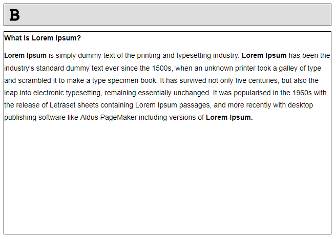

# RichTextEditor
**Rich Text Editor**

<p align="center">
  	
  
	
  <a href="https://www.linkedin.com/in/eliaspjuk/">
    
  </a>
  
  
  <a href="https://github.com/EliasJuk/RichTextEditor/issues">
    
  </a>
  
   
<p>


## ❔ Como criar um Rich Text Editor - EDITOR DE TEXTOS

<p>E mais simples que você imagina criar um editor de textos (Rich Text Editor), o exemplo a seguir mostra como aplicar um negrito (bold) a uma faixa de texto, a parir desde exemplo tenho certeza que você irá conseguir criar o seu com mais funcionalidades.</p>

<h1 align="center">
    
</h1>

Siga os passos a baixo:


### 📝 Index.html
```bash
#Importa icones do Font Awesome
<script src="https://kit.fontawesome.com/d83a960c7e.js" crossorigin="anonymous"></script>
<link rel="stylesheet" href="style.css"/>


<button onclick="bold()">
    <i class=' fas fa-bold fa-2x'></i>
</button>


<div class="editor" contenteditable="true"></div>
<script src="script.js"></script>
```

### 📝 Index.js

```bash
let editor = document.getElementById('editor');

function bold(){
	let cmd = 'bold'
	document.execCommand(cmd, false, null);		
}
```

### 📝 style.css

```bash
#Importa font Roboto do google
@import url('https://fonts.googleapis.com/css2?family=Roboto:wght@400;500;700&display=swap');

* {
    padding: 0;
    margin: 0;
    box-sizing: border-box;
    font-family: 'Roboto', sans-serif;
}

div.editor {
    width: 30vw;
    height: 30vh;
    border: 1px solid black;
    background-color: #fff;
}

li {
    list-style-type: none;
}
```